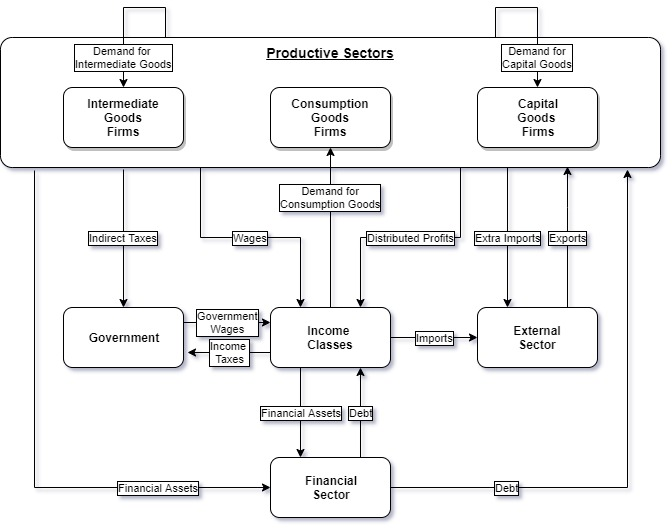

Multisectoral Micro-Macro Model - Core version(ver. 2.9_core)

# THE PROJECT:

This is a new simplified and stylized version of the model created by Dweck (2006) and used in Dweck, Vianna and Barbosa (2018). 

Coded by Matheus Vianna as part of his Ph.D Thesis.

Available as Example Model in Laboratory for Simulation Development (LSD ver.7.2)

# THE MODEL:

The MMM model is a multisectoral micro-macro dynamic model of simulation, that combines theorectical foundations from pos-keynesian, kaleckian and schumpeterian
approaches, useful to investigate general dynamic properties of capitalist economies.

The origin of the MMM model can be traced back to Mario Possas's Ph.D. Thesis (Possas 1983). In order to explain the main components of the dynamics of a capitalist economy, Possas combines theoretical propositions of three of the most influential economists of the twentieth century: John Maynard Keynes, Michail Kalecki and Joseph Schumpeter. 
Possas stablishes a multisectoral model where basic units are the sectors and intersectoral relationships give birth to dynamics, not only sectoral but also aggregated. The model was based on input-output matrices to determine sectoral conponents of the intermediate consumption of each sector. 
As highligthed by the author, the model was already very complex and it would require a solution by computer simulation. However, due to the inexistent computation and processing power at that time, he opted for analytical solution. Only at the end of 90's the author started to work again in the model, now with enough computational power to use numeric solution. 
Possas and Dweck (2004) presented the consolidated MMM model for the first time while Dweck (2006) did an extensive analysis of the dynamic properties.

*********************************************************************************************************************************************

# VERSION 2.0:

  --The intire code, including element names, was translated to english

  --The intire code was translated to LSD Macros, instead of C++ writing

  --The intire code was padronized (see below)

  --Names are now descriptive and intuitive

  --Income classes were transformed into objects

  --Government and External Sector were transformed into objects
  
  --Variables were grouped by objects in additional files

*******************************************************************************************************************************************

# CORE VERSION:

Then, the "2.0_core" Version made some simplifications and stylizations of the model. The goal was to reduce the code as much as possible, in term of lines, number of variable and parameters, without losing too much properties and main results of the 2.0 model. The idea was to turn the model more user friendly, so some names were changed and the code is as clear and descriptive as possible.

--A considerable number of parameters and variables were eliminated or incorporated into another variable, for not beeing in use. Also, many were renamed.

--The Government object was simplified: simple primary budget rule, two types of taxes (income and indirect) and only one type of expenditure (government wages).

--One intermediate goods sector and one income classe wre eliminated . The model is running with 3 sectors, one of each type, and 3 income classes. 

--The Input object was eliminated since there is only one intermediate sector now. All Input variables were reorganized to Firm object or Sector object.

--All essential parameters are in the Sector object. Parameters in other objects are results of Sector parameters or they are rewritten during simulation.

--Creation of Analysis object. In this object there are only analysis variables, with short names for R analysis scripts.

--Calibration: a variable for initial demand calibration based only on essential parameters was created.

--Initialization: a variable for writting initial lagged values and parameters was created.

--R&D variables were simplificated and a few removed. 

--Product Innovation (Quality) does not require capital goods demand to be implemented in this version (simplification).

--Investment variables were revised and rewritten. Mainly the codes were generalized to changes in parameter "investment_period".

--Wage was moved to the Firm level.

--R&D expenses were incorporated to firm's wages, as it should be, and variables as Net_Revenue and Net_Profits were created.

--Entry and exit variables were revised, rewritten and most of them, eliminated.

 # VERSION 2.9_core:

--All essential parameters were moved to MACRO object. (Strong hypothesis: all sectors are equal, except for specific differences already in the code. This is done for a initial sensitivity analysis on those parameters.)

--All variables and parameters were renamed to better organizations and identification.

--Minor Bug Fixes.

*********************************************************************************************************************************************

# HOW TO READ THE CODE:

--All objects use full capital letters

--All variables begin with capital letters

--All parameters begin with small letters (in this version most of them located at MACRO object).

--All functions are variables with the word "_Function" in the end, located at MACRO object

--Most MACRO variable names begin with "Total_"

--Most SECTOR variable names begin with "Sector_"

--Most FIRM variable names begin with "Firm_"

--Most CLASS variable names begin with "Class_"

--Most GOVERNMENT variable names begin with "Government_"

--Variables are grouped in additional files. 

--Most of the variables, except the trivial ones, have line-by-line description

--Frequency Parameters: 
There is a set of parameters that define the frequency of certain decisions or how many periods an agent takes in consideration into its decisions.
All the code is generalized for changes in those parameters.

